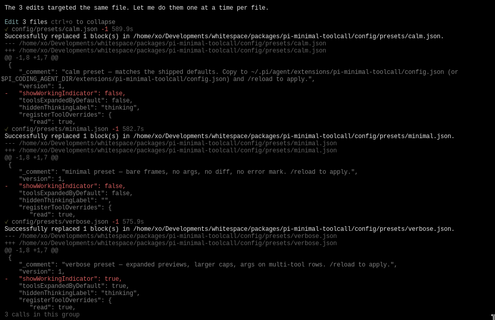
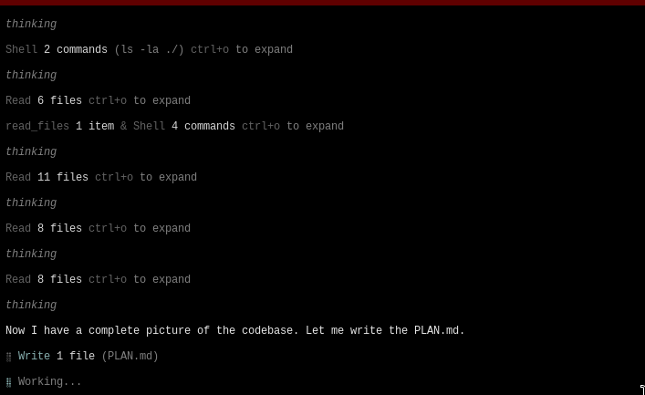

<div align="center">

# pi-minimal-toolcall

Minimalist & less noisy tool-call rendering for [Pi](https://github.com/earendil-works/pi-coding-agent).

</div>

<div align="center">

https://github.com/user-attachments/assets/605cb58b-cbd3-4dfa-9a0d-41f46472038c

</div>

<table>
<tr>
<td align="center" width="50%">



</td>
<td align="center" width="50%">



</td>
</tr>
</table>
<div align="center">
  <i>another extensions you might want to try</i><br/>
  <a href="https://github.com/fahmiirsyadk/pi-record-term.git">pi-record-term</a>
  <span>|</span>
  <a href="https://github.com/fahmiirsyadk/pi-minimal-diff.git">pi-minimal-diff</a>
</div>

## Visual
```
Shell 1 command (grep -rn "friendlyLabel\|nounFor" ./tests ./src --include="*.test.ts" 2>/dev/null | head -10) ctrl+o to expand
Write 1 file (README.md) +148 -129 ctrl+o to expand
Shell 1 command & Read 1 file ctrl+o to expand
⠋ Read file
```

## Installation

Pi package manager:

```bash
pi install npm:@fahmiirsyadk/pi-minimal-toolcall
```

Git Repository:

```
pi install git:github.com/fahmiirsyadk/pi-minimal-toolcall
```

Local clone (for development or pinning to a fork):

```bash
git clone https://github.com/fahmiirsyadk/pi-minimal-toolcall.git ~/pi-minimal-toolcall
```

Then add to your `~/.pi/agent/settings.json`:

```json
{
  "extensions": [
    "~/pi-minimal-toolcall/index.ts"
  ]
}
```

## Quick start for customizing

Edit `~/.pi/agent/extensions/pi-minimal-toolcall/config.json` (or `$PI_CODING_AGENT_DIR/extensions/pi-minimal-toolcall/config.json`):

```json
{
  "toolsExpandedByDefault": true,
  "hiddenThinkingLabel": "",
  "registerToolOverrides": { "bash": false },
  "groupingMode": "proximity",
  "showArgOnSummary": "always"
}
```

Then `/reload` to apply.

Three starter presets ship in [`config/presets/`](./config/presets) — copy the one you want to your config file:

- [`calm.json`](./config/presets/calm.json) — the defaults (one row per group, collapsed tools, `thinking` label).
- [`verbose.json`](./config/presets/verbose.json) — expanded previews, larger body cap, args on multi-tool rows.
- [`minimal.json`](./config/presets/minimal.json) — bare frames, no args, no diff, no `✗`, empty thinking label.

## What you get (Configuration Option)

| Behavior | Default | How to change |
| --- | --- | --- |
| Tool rows | collapsed | `toolsExpandedByDefault: true` |
| Thinking | hidden behind `thinking` label | `hiddenThinkingLabel: "..."` |
| Grouping mode | `proximity` (any tool call joins until text/thinking) | `groupingMode: "consecutive" \| "none"` |
| Latest arg on summary | single-tool groups only | `showArgOnSummary: "always" \| "never"` |
| Aggregated `+N -M` | on | `showDiffSuffix: false` |
| Per-tool `✗` | on | `showErrorMark: false` |
| Write expand | full content, syntax-highlighted | `writeExpandMode: "summary" \| "both"` |
| Expanded body cap | 200 lines | `expandedBodyMaxLines: <n>` |
| Spinner | `⠋⠙⠹⠸⠼⠴⠦⠧⠇⠏` @ 80ms | `spinnerFrames: ["a","b"]`, `spinnerIntervalMs: <n>` |
| Per-tool ownership | all 7 built-ins | `registerToolOverrides: { "read": false, ... }` |
| Batch tools (`read_files`, `edit_files`, `grep_files`, `find_files`) | on | `batchToolsEnabled: false` |
| Debug log | off | `debug: true` (writes to `<agent-dir>/.../debug/debug.log`) |

## How grouping works

A **group** is a run of tool calls with no text or thinking between them, regardless of tool name. Frozen when a text or thinking block appears (`message_update` with `text_start` / `thinking_start`), or when a new agent loop starts (`agent_start` — separates prompts).

```
read, read, read                  → Read 3 files
read, read, bash, read            → one row (proximity)
text or thinking
bash, bash                        → Shell 2 commands (new group)
```

`groupingMode: "consecutive"` restores the old "different tool name = new group" behavior. `"none"` makes every call its own row.

## Batch tools

The package registers four batch tools the model can call instead of repeating built-ins:

| Tool | Input |
| --- | --- |
| `read_files` | `{ paths, offset?, limit? }` |
| `edit_files` | `{ edits: [{ path, oldText, newText }] }` |
| `grep_files` | `{ queries: [{ pattern, path? }] }` |
| `find_files` | `{ queries: [{ pattern, path? }] }` |

Each renders as one row; `ctrl+o` expands to per-item `✓`/`✗` status plus aggregated output. Partial failures surface per item.

## Reload

`/reload` re-reads `config.json` and re-registers. Tool ownership, the per-tool grouping session, and the debug-log path all take effect on the next `session_start`.

## Compatibility

- Pi `0.79.0+`. Peer dependencies: `@earendil-works/pi-coding-agent`, `pi-ai`, `pi-tui`, `typebox` (all `*` range — pi bundles these).
- This package only changes tool-call rendering. We touch two pieces of global UI state on `session_start` (and only these two — we don't touch the working indicator, the prompt box, or anything else outside our scope):
  - `ctx.ui.setToolsExpanded(config.toolsExpandedByDefault)` — the resting state of tool output (collapsed vs expanded). `ctrl+o` toggles it during a session.
  - `ctx.ui.setHiddenThinkingLabel(config.hiddenThinkingLabel)` — the label on the thinking block.
- Tools registered by other extensions render with their own renderer and break proximity groups.

## Development

```bash
npm install
npm run check        # typecheck + test
npm run pack:dry     # preview the published tarball
```

Uses `tsc` for typecheck and `tsx --test` for tests. No bundler, no
formatter, no linter — keep the dep tree small.

## License

MIT
